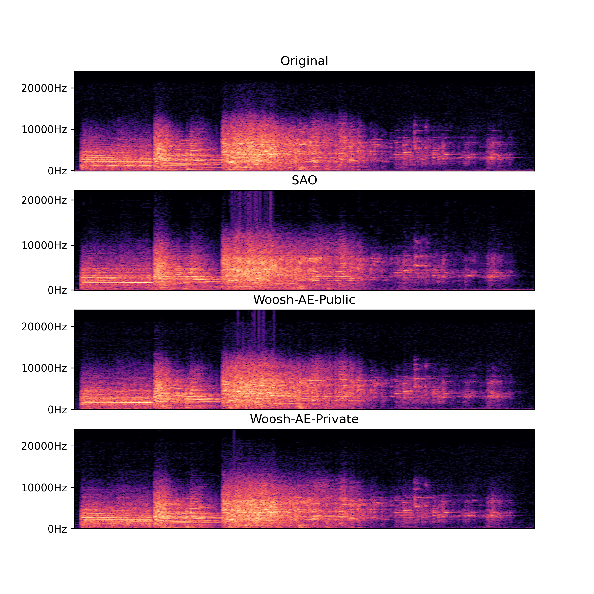
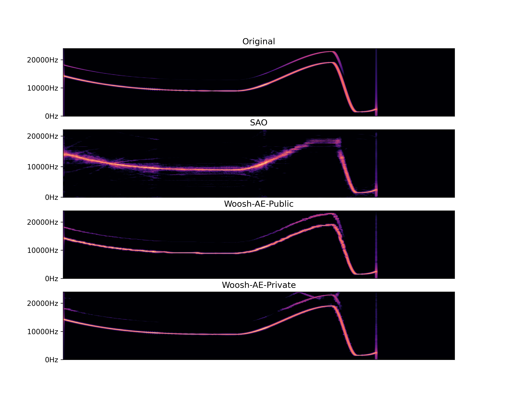

We provide audio samples for each of the Woosh models in this page:

# Woosh-AE

### Sample 1: [Source](media/sample1-original.wav) | [SAO](media/sample1-sao.wav) | [Woosh-AE-Public](media/sample1-wooshae-public.wav) | [Woosh-AE-Private](media/sample1-wooshae-private.wav)

### Sample 2: [Source](media/sample2-original.wav) | [SAO](media/sample2-sao.wav) | [Woosh-AE-Public](media/sample2-wooshae-public.wav) | [Woosh-AE-Private](media/sample2-wooshae-private.wav)

### Sample 3: [Source](media/sample3-original.wav) | [SAO](media/sample3-sao.wav) | [Woosh-AE-Public](media/sample3-wooshae-public.wav) | [Woosh-AE-Private](media/sample3-wooshae-private.wav)

# Woosh-Flow
# Woosh-DFlow
# Woosh-VFlow
